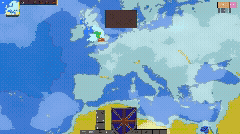

# 🌍 Europe Domination

**A turn-based grand strategy game built with Godot Engine and C#.**

---

## 📌 About The Project

**Europe Domination** is a turn-based grand strategy game where players manage resources, expand territories, and outmaneuver opponents across a map of Europe.

Developed as a deep dive into game engine architecture and object-oriented design, the project demonstrates complex UI management, interactive map logic, and robust game state persistence.

### ✨ Key Features

* **Interactive Map System:** Dynamic territory selection, highlighting, and control mechanics.
* **Turn-Based Logic:** Structured game loops governing resource generation, troop movements, and player phases.
* **Resource & Economy Management:** Core systems for tracking and updating player economies in real-time.
* **Custom UI Architecture:** Responsive user interface elements built specifically for grand strategy gameplay data.

---

## 🛠️ Built With

* **Game Engine:** [Godot Engine](https://www.google.com/search?q=https://godotengine.org/) (v4.x)
* **Language:** [C#](https://www.google.com/search?q=https://docs.microsoft.com/en-us/dotnet/csharp/)
* **Architecture:** Object-Oriented Programming (OOP), Node-based component system.

---

## 🧠 Technical Highlights (For Developers)

While grand strategy games are fun to play, they require rigorous software engineering under the hood. This project highlights:

* **Strict State Management:** Using C# to manage complex game states, ensuring that turns, resources, and territory ownership remain perfectly synchronized without race conditions.
* **Engine Integration:** Bridging Godot's built-in Node architecture with custom C# scripts for optimized performance and clean code separation.
* **Event-Driven UI:** Implementing signal-based UI updates to keep the player informed without locking the main game loop.
* **Custom Map shaders and text fitters:** Implemented shaders to change the map and auto fitting text objects.

---

## 🚀 Getting Started

To explore the code or run the game locally on your machine:

### Prerequisites

* [Godot Engine](https://www.google.com/search?q=https://godotengine.org/download) (.NET version is required to compile C# code).
* .NET SDK installed on your system.

### Installation & Running

1. **Clone the repository:**
`git clone https://github.com/Pazzann/EuropeDomination.git`
2. **Import into Godot:**
Open the Godot Engine, click **Import**, and select the `project.godot` file located in the cloned folder.
3. **Build and Play:**
Click the **Build** button in the top right corner of the editor to compile the C# scripts, then press **Play** (or `F5`) to launch the game.

---

